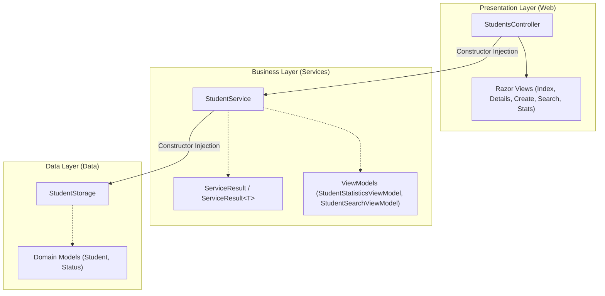
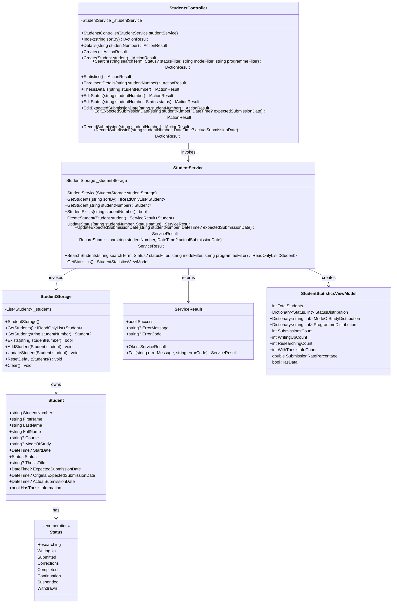
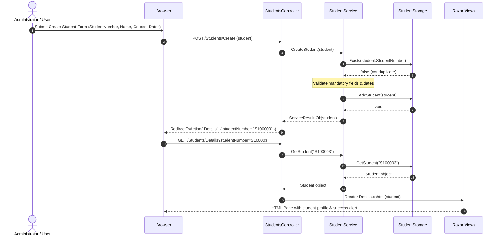
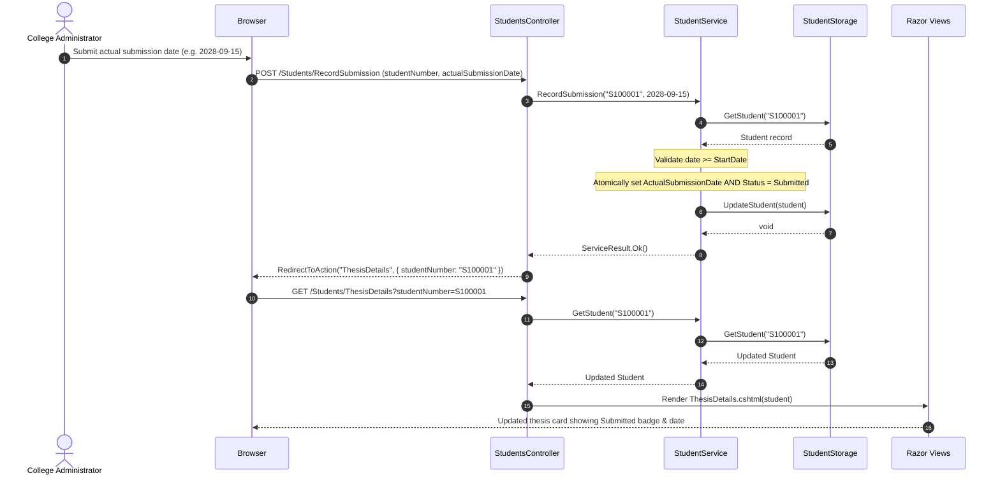
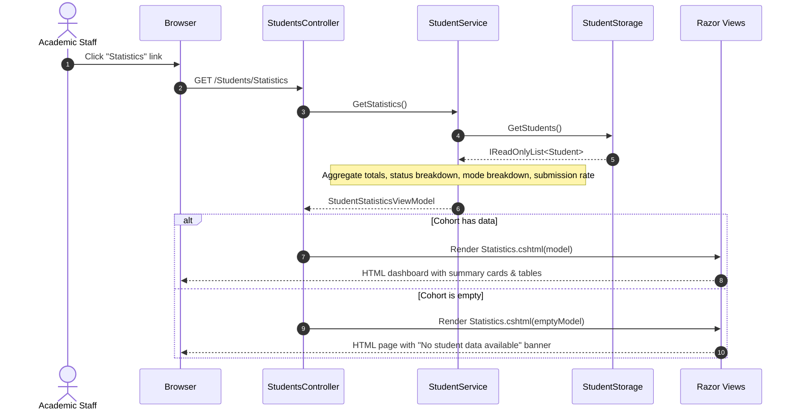

# Week 3 PGR Student Management: Layered Architecture Documentation

## 1. Executive Summary & Architectural Evolution

In Week 2, the application followed a 2-tier MVC pattern where the controller (`StudentsController`) directly held and mutated a static in-memory student collection. This violated the Single Responsibility Principle and coupled presentation concerns with business rules and data persistence.

In Week 3, the application has been refactored into a **3-Tier Layered Architecture** as specified in `instructions.md`. The design enforces strict separation of concerns, unidirectional dependencies, and inversion of control via ASP.NET Core Dependency Injection.

```
┌─────────────────────────────────────────────────────────┐
│                   Presentation Layer                    │
│   StudentsController  │  HomeController  │  Razor Views │
└────────────────────────────┬────────────────────────────┘
                             │ (Calls business operations)
                             ▼
┌─────────────────────────────────────────────────────────┐
│                     Business Layer                      │
│      StudentService   │  ServiceResult<T>  │  Rules     │
└────────────────────────────┬────────────────────────────┘
                             │ (Calls data persistence)
                             ▼
┌─────────────────────────────────────────────────────────┐
│                       Data Layer                        │
│          StudentStorage (Singleton In-Memory)           │
└─────────────────────────────────────────────────────────┘
```

---

## 2. Layer Responsibilities & Design Patterns

### 2.1 Presentation Layer (`PgrStudentManagement.Web/Controllers` & `Views`)
- **Components**: `StudentsController`, `HomeController`, Razor Views (`Views/Students/*`, `Views/Shared/*`).
- **Responsibilities**:
  - Receive HTTP requests and extract routing parameters and form payloads.
  - Delegate all business logic and validation to `StudentService`.
  - Interpret `ServiceResult` outcomes returned by the business layer.
  - Select appropriate Razor views, redirects, view models, and user flash messages (`TempData`).
- **Constraints**:
  - The controller contains **no direct references** to `StudentStorage` or in-memory lists.
  - No domain business rules (e.g. date validations, atomic status changes) are performed inside the controller.

### 2.2 Business Layer (`PgrStudentManagement.Web/Services`)
- **Components**: `StudentService`, `ServiceResult`, `ServiceResult<T>`.
- **Responsibilities**:
  - Coordinate student management business operations.
  - Enforce domain rules (e.g. duplicate student ID checks, start date vs submission date validation).
  - Apply data transformations, business ordering (e.g. sort by StudentNumber, Name, Programme, Status), and multi-field search logic.
  - Perform cohort analytics and statistics calculations (W3-UC05).
  - Coordinate atomic domain transactions (e.g. setting actual submission date and updating status to `Submitted` together).
- **Constraints**:
  - The service is decoupled from ASP.NET Core MVC controllers, `IActionResult`, and HTTP context.
  - Receives `StudentStorage` via constructor dependency injection.

### 2.3 Data Layer (`PgrStudentManagement.Web/Data`)
- **Components**: `StudentStorage`.
- **Responsibilities**:
  - Own and encapsulate the in-memory `List<Student>` as a `private readonly` instance field.
  - Provide CRUD operations: `GetStudents()`, `GetStudent(id)`, `AddStudent(student)`, `UpdateStudent(student)`, `Exists(id)`.
  - Initialise and reset seed student records (`S100001` - John Doe, `S100002` - Jane Smith).
- **Constraints**:
  - Storage is registered as a **Singleton** in `Program.cs`, guaranteeing one consistent dataset during the application process lifecycle.
  - Does not contain HTTP or presentation dependencies.

---

## 3. Dependency Injection Configuration (`Program.cs`)

```csharp
// Program.cs
builder.Services.AddSingleton<StudentStorage>(); // Data layer: single in-memory store
builder.Services.AddScoped<StudentService>();    // Business layer: created per request
```

- **`StudentStorage` (Singleton)**: Maintains the in-memory collection across all web requests during application execution.
- **`StudentService` (Scoped)**: Instantiated per HTTP request, receiving the singleton `StudentStorage` via constructor injection.
- **`StudentsController`**: Receives `StudentService` via constructor injection.

---

## 4. Comprehensive UML Diagrams

### 4.1 Package / Layer Architecture Diagram



### 4.2 Class Diagram



### 4.3 Sequence Diagram 1: W3-UC01 Create Student (with Duplicate Check)



### 4.4 Sequence Diagram 2: W2-UC05 Record Actual Thesis Submission (Atomic Update)



### 4.5 Sequence Diagram 3: W3-UC05 View Student Statistics



---

## 5. Implemented Use Cases Catalog

| Use Case ID | Name | Actor | Layer Flow | View | Key Business Rules & Alternative Flows |
|---|---|---|---|---|---|
| **W2-UC01** | View Enrolment Details | Student / Staff | `Controller` &rarr; `Service` &rarr; `Storage` | `EnrolmentDetails.cshtml` | View-only; *Alt Flow*: Student Not Found renders `StudentNotFound.cshtml`. |
| **W2-UC02** | View Thesis Details | Student / Staff | `Controller` &rarr; `Service` &rarr; `Storage` | `ThesisDetails.cshtml` | View-only; *Alt Flow*: Missing thesis details displays informational banner. |
| **W2-UC03** | Update Student Status | College Administrator | `Controller` &rarr; `Service` &rarr; `Storage` | `EditStatus.cshtml` | Enforces valid `Status` enum; redirects to `EnrolmentDetails` upon success. |
| **W2-UC04** | Update Expected Submission Date | College Administrator | `Controller` &rarr; `Service` &rarr; `Storage` | `EditExpectedSubmissionDate.cshtml` | Validates date &ge; `StartDate`; updates target date. |
| **W2-UC05** | Record Actual Thesis Submission | College Administrator | `Controller` &rarr; `Service` &rarr; `Storage` | `RecordSubmission.cshtml` | **Atomic update**: sets `ActualSubmissionDate` and transitions status to `Submitted`. |
| **W3-UC01** | Create Student | College Administrator | `Controller` &rarr; `Service` &rarr; `Storage` | `Create.cshtml` | Mandatory validation (`StudentNumber`, `FirstName`, `LastName`); *Alt Flow*: Duplicate Student Number validation. |
| **W3-UC02** | List Students | All Users | `Controller` &rarr; `Service` &rarr; `Storage` | `Index.cshtml` | Default ordering by student number; sort links; *Alt Flow*: "No students found" empty state. |
| **W3-UC03** | View Student Details | All Users | `Controller` &rarr; `Service` &rarr; `Storage` | `Details.cshtml` | Combined Enrolment + Thesis profile; quick action links; *Alt Flow*: Student Not Found. |
| **W3-UC04** | Search Students | All Users | `Controller` &rarr; `Service` &rarr; `Storage` | `Search.cshtml` | Case-insensitive multi-field search (ID, name, programme, thesis) + Status/Mode filters; *Alt Flow*: "No matching students found". |
| **W3-UC05** | View Student Statistics | Academic Staff | `Controller` &rarr; `Service` &rarr; `Storage` | `Statistics.cshtml` | Aggregates cohort count, submission rate, status and mode distributions; *Alt Flow*: "No student data available". |

---

## 6. Answers to Reflection Questions

1. **Which responsibilities moved out of `StudentController`?**
   - Data collection ownership, direct collection mutation, in-memory list filtering, business validation rules (e.g. date vs start date checks, duplicate ID detection), and statistical aggregations moved out of the controller into `StudentService` and `StudentStorage`.

2. **Which responsibilities belong to `StudentService`?**
   - Business rule validation, input normalization, uniqueness validation, domain calculations, ordering/sorting algorithms, multi-criteria filtering, aggregation/analytics generation, and coordinating domain transactions across storage.

3. **Why does `StudentStorage` own the in-memory collection?**
   - To adhere to the Single Responsibility Principle. Persistence concerns (storing, retrieving, and updating entity records) should be isolated from presentation and business logic, providing a clean boundary for future migration to EF Core or SQL databases.

4. **Why is the collection an instance field rather than a static field?**
   - An instance field inside a Singleton service enables proper dependency injection, lifecycle management, testability, and isolation. It prevents global state leakage and allows mock/stub implementations or multiple storage instances during unit testing.

5. **What would happen if the controller and service maintained separate lists?**
   - State synchronization would fail. Mutations performed via service operations would not be reflected in the controller's list, leading to data inconsistency, phantom records, and stale views.

6. **How does constructor injection make dependencies visible?**
   - Dependencies are explicitly declared in constructor parameters. Any consumer or test runner can immediately identify what dependencies a class requires to function, preventing hidden dependencies and enabling mock substitution without reflection.

7. **Which layer orders the student list?**
   - The **Business Layer (`StudentService`)**. Ordering is a business concern (e.g. sorting students alphabetically or by enrolment date).

8. **Which layer determines whether a student number already exists?**
   - The **Business Layer (`StudentService`)** coordinates the decision by querying the data layer (`_studentStorage.Exists()`) and returning appropriate business failure results.

9. **Which layer selects the Razor view?**
   - The **Presentation Layer (`StudentsController`)**. Selecting views, status codes, view models, and HTTP redirects is purely a presentation responsibility.

10. **Which changes were structural rather than functional?**
    - The extraction of `StudentStorage` and `StudentService`, moving `List<Student>` from a static controller field to a singleton storage instance, and injecting services via ASP.NET Core DI were purely structural refactorings that preserved existing functionality while improving cohesion, coupling, and testability.

---

## 7. Automated Test Suite (`PgrStudentManagement.Tests`)

The test suite contains **42 automated xUnit tests** covering all three layers:

- **`StudentStorageTests`**: Tests data layer persistence, lookups, isolation, and reset behavior.
- **`StudentServiceTests`**: Tests business rules, validations, duplicate detection, atomic transitions, search logic, and statistics computations.
- **`StudentsControllerTests`**: Tests presentation action results, view model binding, redirect destinations, TempData flash messages, and error handling.

### Running the Tests

To run the complete automated test suite:

```bash
dotnet test
```

To run with detailed step-by-step diagnostic output:

```bash
dotnet test --logger "console;verbosity=detailed"
```

---

## 8. How to Run the Application

From the repository root:

```bash
dotnet run --project PgrStudentManagement.Web
```

Open your browser and navigate to:
- **Student Directory**: `https://localhost:<port>/Students`
- **Create Student (W3-UC01)**: `https://localhost:<port>/Students/Create`
- **Search Students (W3-UC04)**: `https://localhost:<port>/Students/Search`
- **Cohort Statistics (W3-UC05)**: `https://localhost:<port>/Students/Statistics`
