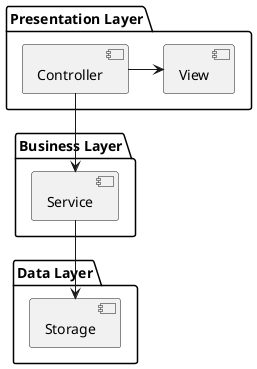

# Week 3 Lab 1: Refactor Student Management into a Layered Architecture

## Purpose

In Week 2, the MVC controller received requests, accessed the in-memory student collection, changed student data, and selected views.

The application will continue to manage student data in memory.

## Learning Outcomes

By completing this lab, you should be able to:

1. Explain the responsibilities of presentation, business, and data layers.
2. Move application behaviour from a controller into a service.
3. Move in-memory data access into a data-layer class.
4. Use dependency injection to provide dependencies.
5. Preserve behaviour while refactoring an implementation.
6. Implement new Student Management use cases through the layered architecture.
7. Keep use cases, field choices, views, layers, and code consistent.

## Files and Project Required

Before starting, make sure you have:

- Your working Week 2 project
- Your revised Week 2 `Student` domain model
- Your Week 2 use-case descriptions
- The Week 3 student use-case document
- Your Week 2 class and sequence diagrams
- Any tests or design notes you created

Continue working in the same project or repository retained from Week 2.

## Layer Responsibilities



### Presentation Layer

Includes `StudentController` and Razor views.

It should:

- Receive requests and submitted values.
- Call service operations.
- Select views, redirects, and responses.
- Display results and messages.

The controller must not search or modify the in-memory collection directly.

### Business Layer

Includes `StudentService`.

It should:

- Coordinate Student Management operations.
- Apply business rules.
- Define ordering, searching, and calculations.
- Call the data layer.
- Return outcomes that the controller can present.

The service must not depend on MVC controllers, Razor views, or HTTP-specific classes.

### Data Layer

Includes `StudentStorage` and its in-memory `List<Student>`.

It should:

- Own and initialise the student collection.
- Return all students.
- Find a student by student number.
- Add a student.
- Update student data.

The storage class must not depend on controllers or Razor views.

## Domain-Model Decisions

Use the same candidate domain model considered in Week 2. It contains a broad set of candidate attributes, and as before, you are not required to implement every supplied field.

For each use case, review and record:

- Which student attributes are included.
- Which attributes are mandatory or optional.
- Which fields appear in creation, list, and details views.
- Which fields can be searched.
- Which fields can be used for statistics.
- How missing optional information is represented.
- How expected, original expected, and actual thesis submission dates are represented.

Use the same terminology and field choices throughout the domain model, service methods, storage methods, controller actions, views, and tests.

# Core Tasks

## Task 1: Preserve and Check the Week 2 Project

1. Build and run your Week 2 application.
2. Exercise `W2-UC01` to `W2-UC05`.
3. Record the behaviour that must remain unchanged.
4. Commit or copy the working version before refactoring.

```bash
git status
git add .
git commit -m "Preserve working Week 2 implementation"
```

## Task 2: Review Current Responsibilities

Inspect `StudentController` and identify where the code:

- Receives requests.
- Selects views or redirects.
- Finds students.
- Updates student information.
- Applies business rules.
- Orders records.
- Accesses the static collection.

Record each responsibility, its current location, and its intended Week 3 layer.

## Task 3: Create StudentStorage

Create a data-layer folder such as:

```text
Data/
```

Create `StudentStorage` and move the in-memory collection out of the controller.

Use an instance field:

```csharp
private readonly List<Student> _students;
```

The collection should be an instance field of the singleton
`StudentStorage`. Do not retain the static collection from the Week 2
controller.

Representative storage operations are:

```csharp
public IReadOnlyList<Student> GetStudents()
{
    throw new NotImplementedException();
}

public Student? GetStudent(string studentNumber)
{
    throw new NotImplementedException();
}

public void AddStudent(Student student)
{
    throw new NotImplementedException();
}

public void UpdateStudent(Student student)
{
    throw new NotImplementedException();
}
```

Adapt names and return types where appropriate.

Check that:

- The collection is an instance field private to the data layer.
- A caller cannot replace the collection directly.
- Student lookup uses the student number consistently.
- The controller no longer owns or accesses the collection.
- The data layer contains no view, redirect, or HTTP logic.

## Task 4: Create StudentService

Create a business-layer folder such as:

```text
Services/
```

Create `StudentService` and inject `StudentStorage` through its constructor:

```csharp
public class StudentService
{
    private readonly StudentStorage _studentStorage;

    public StudentService(StudentStorage studentStorage)
    {
        _studentStorage = studentStorage;
    }
}
```

Representative service operations include:

```csharp
public IReadOnlyList<Student> GetStudents()
{
    throw new NotImplementedException();
}

public Student? GetStudent(string studentNumber)
{
    throw new NotImplementedException();
}

public void CreateStudent(Student student)
{
    throw new NotImplementedException();
}

public void UpdateStatus(string studentNumber, Status status)
{
    throw new NotImplementedException();
}

public void UpdateExpectedSubmissionDate(
    string studentNumber,
    DateTime? expectedSubmissionDate)
{
    throw new NotImplementedException();
}

public void RecordSubmission(
    string studentNumber,
    DateTime? actualSubmissionDate)
{
    throw new NotImplementedException();
}
```

These signatures are examples. Choose names, parameters, outcomes, and return types that match your use cases and implementation.

Move business decisions out of the controller. Do not move the student collection into the service.

## Task 5: Register the Layers

Register the data and business classes in `Program.cs`:

```csharp
builder.Services.AddSingleton<StudentStorage>();
builder.Services.AddScoped<StudentService>();
```

The singleton `StudentStorage` owns one in-memory collection for the
lifetime of the running application process. Its contents are lost when
the application stops or restarts.
The scoped service is created for an individual web request.

## Task 6: Refactor StudentController

Inject `StudentService` into `StudentController`:

```csharp
public class StudentController : Controller
{
    private readonly StudentService _studentService;

    public StudentController(StudentService studentService)
    {
        _studentService = studentService;
    }
}
```

Refactor the actions for `W2-UC01` to `W2-UC05` so that each action:

1. Receives request values.
2. Calls an appropriate service method.
3. Interprets the outcome.
4. Selects a view, redirect, or message.

Remove all direct controller access to the in-memory list and `StudentStorage`.

## Task 7: Verify the Reused Week 2 Use Cases

Exercise:

- `W2-UC01`: View Enrolment Details
- `W2-UC02`: View Thesis Details
- `W2-UC03`: Update Student Status
- `W2-UC04`: Update Expected Thesis Submission Date
- `W2-UC05`: Record Actual Thesis Submission

Check that:

- Main success scenarios still work.
- Supplied alternative flows still work.
- View-only operations do not modify student data.
- Unsuccessful updates leave existing values unchanged.
- Recording an actual thesis submission changes its date and status together.
- The controller no longer accesses the collection directly.

## Task 8: Implement W3-UC01 Create Student

Read `W3-UC01` and record your choices for creation fields, mandatory fields, optional fields, and additional attribute business rules.

Implement the flow through:

```text
Create view -> StudentController -> StudentService -> StudentStorage
```

Your implementation should:

- Display a creation form.
- Accept the selected student information.
- Avoid creating a student when information selected as mandatory is missing.
- Determine through the service whether the student number already exists.
- Add the student through `StudentStorage`.
- Follow the supplied **Duplicate Student Number** alternative flow.
- Display the created student's details.
- Include the new student in the student list.

## Task 9: Implement W3-UC02 List Students

Read `W3-UC02` and record your summary-field, ordering, and missing-value decisions.

Your implementation should:

- Retrieve records from `StudentStorage` through `StudentService`.
- Apply the selected ordering in the business layer.
- Display the selected summary fields.
- Provide a Details option for each student.
- Follow the supplied **No students found** alternative flow.
- Leave student data unchanged.

## Task 10: Implement W3-UC03 View Student Details

Read `W3-UC03` and record your decisions about details fields and missing optional information.

Your implementation should:

- Receive or select a student number.
- Retrieve the student through `StudentService` and `StudentStorage`.
- Display the selected detail fields.
- Follow the supplied **Student not found** alternative flow.
- Leave student data unchanged.

# Extension Tasks

## Extension Task 1: Implement W3-UC04 Search Students

Read `W3-UC04` and decide:

- Which fields are searchable.
- Whether partial matching is supported.
- Whether comparisons are case-sensitive.
- How multiple criteria are combined.
- Whether an empty search displays all students, displays no results, or is not submitted.

The controller should receive the search request, the service should define search behaviour, and storage should provide access to records.

Follow the supplied **No matching students found** alternative flow when no records satisfy the criteria.

## Extension Task 2: Implement W3-UC05 View Student Statistics

Read `W3-UC05`.

The total number of students is required. Select at least one additional statistic supported by the fields in your domain model.

For each statistic, decide what it measures, which fields it uses, how missing values are treated, and how the result is displayed.

The service should calculate the statistics. The controller should present the result. Storage should provide access to the student records.

Follow the supplied **No student data available** alternative flow when no records are available.

## Extension Task 3: Create or Update Tests

No tests are supplied. Create or update tests where practical to demonstrate that:

- Reused Week 2 behaviour remains unchanged.
- The controller obtains Student Management outcomes through `StudentService` rather than accessing `StudentStorage` directly.
- `StudentService` applies the relevant business behaviour.
- `StudentStorage` returns and changes the intended records.
- A duplicate student number does not create a second record.
- List and details operations do not modify student data.
- Search and statistics behave as documented, if implemented.

Architectural dependency direction may also be checked through code inspection and the class diagram if appropriate test-double techniques have not been introduced.

## Extension Task 4: Identify Additional Alternative Flows

After implementing the supplied scenarios, identify additional alternative flows.

For every new flow:

1. Add it to the corresponding use-case description.
2. Identify the main-scenario step where it begins.
3. State the observable response and postconditions.
4. Decide which layer is responsible for the business decision.
5. Add or update tests where practical.
6. Keep all artefacts consistent.

# Reflection Questions

1. Which responsibilities moved out of `StudentController`?
2. Which responsibilities belong to `StudentService`?
3. Why does `StudentStorage` own the in-memory collection?
4. Why is the collection an instance field rather than a static field?
5. What would happen if the controller and service maintained separate lists?
6. How does constructor injection make dependencies visible?
7. Which layer orders the student list?
8. Which layer determines whether a student number already exists?
9. Which layer selects the Razor view?
10. Which changes were structural rather than functional?

# Completion Checklist

## Core

- [ ] I preserved a working Week 2 version.
- [ ] I documented current controller responsibilities.
- [ ] I created `StudentStorage` with an instance collection.
- [ ] I created `StudentService`.
- [ ] I registered both classes in `Program.cs`.
- [ ] I injected `StudentService` into `StudentController`.
- [ ] The controller accesses neither the collection nor storage directly.
- [ ] I refactored and verified `W2-UC01` to `W2-UC05`.
- [ ] I implemented `W3-UC01` to `W3-UC03`.
- [ ] I documented fields selected for forms, lists, and details.
- [ ] I updated the class diagram and two sequence diagrams.
- [ ] The use cases, domain model, layers, views, and implementation are consistent.

## Extensions

- [ ] I implemented `W3-UC04`, if attempted.
- [ ] I implemented `W3-UC05`, if attempted.
- [ ] I created or updated tests, if attempted.
- [ ] I documented additional alternative flows, if attempted.

# Keeping the Project for Later Weeks

There is no submission for this Week 3 project.

Keep the complete project, models, use cases, diagrams, tests, and notes in your files or source-control repository for later weeks.

Recommended checkpoint:

```bash
git status
git add .
git commit -m "Complete Week 3 layered architecture iteration"
```
